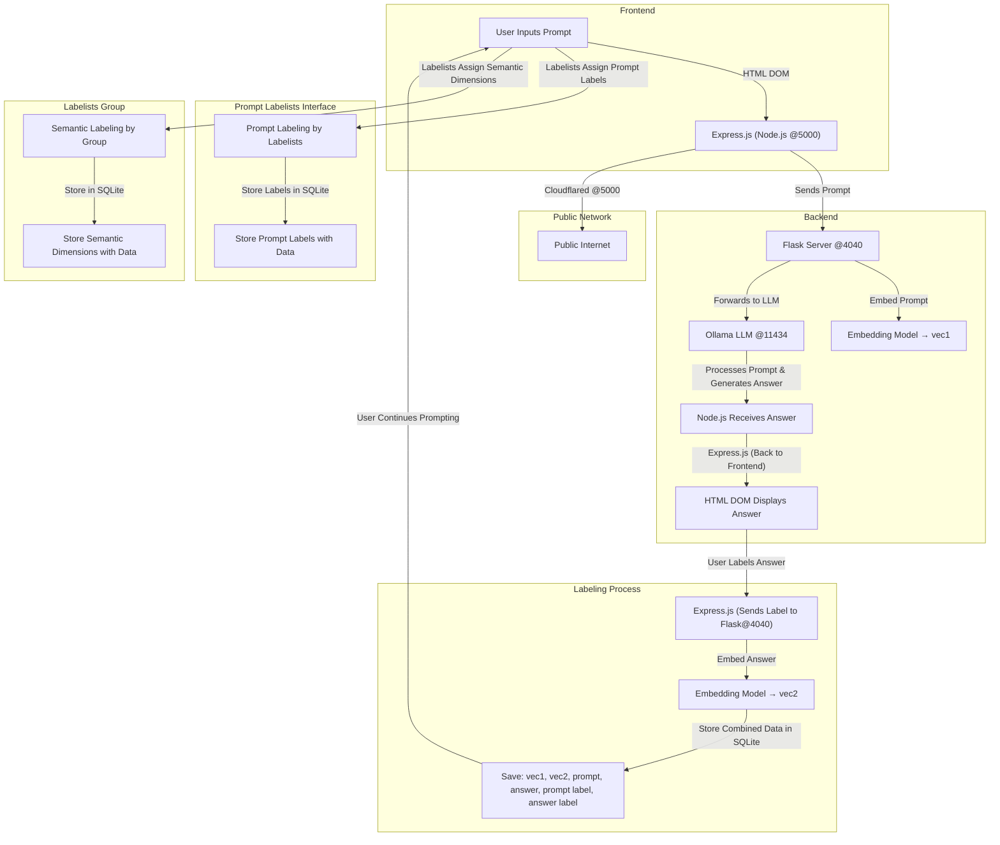

# Roadmap
Roadmap for the club.

The club's main focus is **analytic prompt engineering** **systematic semantics analysis of prompts and answers**. 

The roadmap and development pipeline of the analytics team is as follows:

